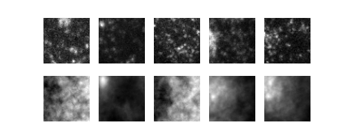
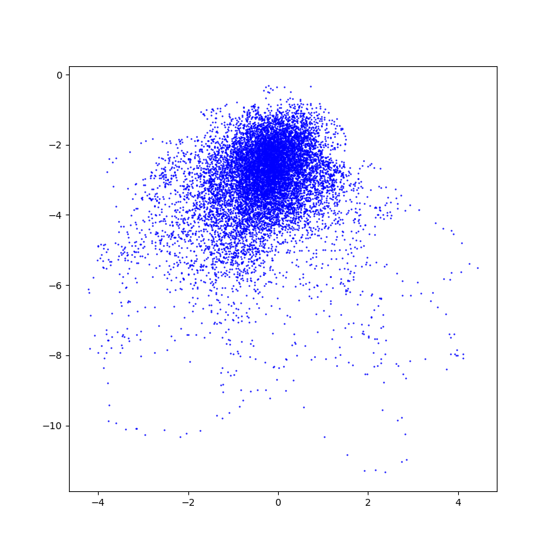

# Auto-Encoders for MNIST: TF 2.0
Implementations of AE(Auto-Encoder), VAE(Variational AE) and CVAE(Conditional VAE)

## Results

### AE(Auto-Encoder)

```
python run_main.py --ae_type AE --num_epochs 150 --latent_dim 2
```

<table>
<tr>
<td>Reconsructed Image</td>
<td></td>
</tr>
<tr>
<td>Distribution of z</td>
<td></td>
</tr>
</table>

## References
[1] https://github.com/hwalsuklee/tensorflow-mnist-VAE  
[2] https://www.slideshare.net/NaverEngineering/ss-96581209  
[3] https://www.tensorflow.org/alpha/tutorials/generative/cvae  
